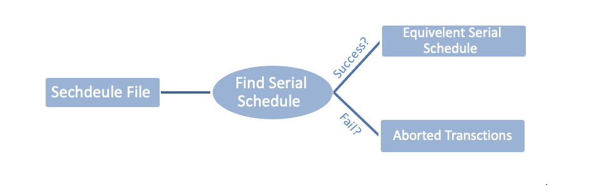

# Multi-version-Timestamp-Ordering-System-MVTS-
This is a project of multi-version timestamp ordering, which is used to increase the concurrency, because each data item can have a sequence of versions. 

# Design 
In this project, we implement Multi-version Timestamp Ordering protocol using java language. The system will ask the user to upload a file to show the serial schedule. If there are any aborted transactions, the aborted transactions will appear to the user. otherwise, the equivalent serial schedule will appear.
 

  

            
# Installation
clone with https https://github.com/noufAlfayez/Multi-version-Timestamp-Ordering-System-MVTS-.git

# Usage
You must have a text file to test the application on it.

